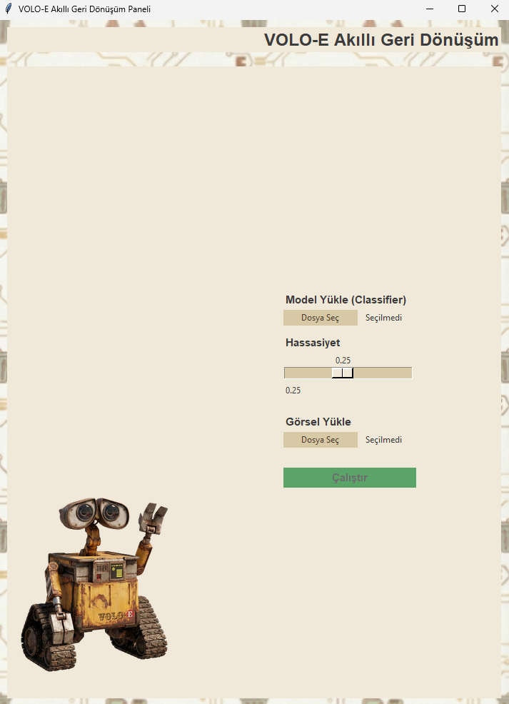
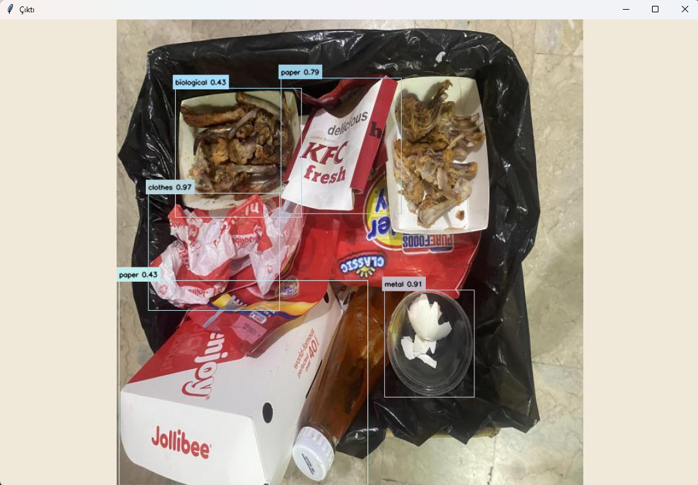

## VOLO-E Akıllı Geri Dönüşüm 

YOLO dedektör + PyTorch sınıflandırıcı ile katı atıkları algılayıp sınıflayan, Tkinter arayüzlü masaüstü uygulaması.

| Arayüz | Çıktı |
| --- | --- |
|  |  |

## Özellikler
- ✅ YOLO tabanlı atık tespiti + SimpleCNN sınıflandırma (10 sınıf).
- 🖥️ Tkinter GUI: model seç, hassasiyet kaydır, tek tıkla çalıştır.
- 📝 Annotated çıktı (`output_infer`) + JSON tespit listesi.
- 📦 Otomatik veri hazırlama (Kaggle birleşik seti).
- ⬇️ Kolay model indirme (Google Drive → `models/classifier/model`).

## Proje Yapısı
- `main_gui.py` : Masaüstü arayüz (Tkinter), `inference.py` ile çalışır.
- `inference.py` : YOLO dedektör + sınıflandırıcı inference (dinamik çizim, pad/normalize).
- `main_training.py` : Sıfırdan sınıflandırıcı eğitimi (SimpleCNN, `output_short/`).
- `training_ex.py` : Fine-tune/ekstra eğitim (ağırlık çarpanlarıyla).
- `prepare_kaggle_datasets.py` : Kaggle veri setlerini indirip `dataset/` olarak böler.
- `model_downloader.py` : Google Drive klasörünü `models/classifier/model` içine indirir.
- `models/detector/best_yolo.pt` : Varsayılan YOLO dedektör ağırlığı.
- `test_images/` : Hızlı deneme görselleri.
- `assets/` : Arka plan, GUI, örnek çıktı ve maskotlar.

## Gereksinimler
- Python 3.9+
- Önerilen paketler (`requirements.txt` yoksa manuel kur):  
  `torch torchvision pillow pandas scikit-learn matplotlib seaborn ultralytics kaggle gdown opencv-python`
- GPU varsa PyTorch’un CUDA’lı sürümünü tercih edin.

## Hızlı Başlangıç (Inference)
1) Modelleri hazırla  
   - Dedektör: `models/detector/best_yolo.pt` repoda hazır.  
   - **Sınıflandırıcı: Büyük boyutlu, GitHub’da yok. İndirmek zorunlu.**  
     ```bash
     pip install gdown
     python model_downloader.py
     ```
     Dosyalar `models/classifier/model/` altına iner (`best_model.pt`, `summary.json` vb.). İndirmeden GUI/CLI çalışmaz.

2) GUI’yi çalıştır  
   ```bash
   python main_gui.py
   ```
   - “Model Yükle” ile `.pt` dosyasını seç, aynı klasördeki `summary.json` otomatik beklenir.  
   - Hassasiyet slider’ını ayarla, görseli seç, “Çalıştır” de.

3) CLI ile inference (annotated PNG + JSON)  
   ```bash
   python inference.py ^
     --image test_images/1.jpg ^
     --detector models/detector/best_yolo.pt ^
     --classifier models/classifier/model/best_model.pt ^
     --summary models/classifier/model/summary.json ^
     --out_dir output_infer --conf 0.25
   ```
   Çıktılar: `output_infer/<isim>_annotated.png`, `output_infer/<isim>_detections.json`.

## Veri Hazırlama (Kaggle)
Kaynaklar: `sumn2u/garbage-classification-v2`, `feyzazkefe/trashnet`  
Hedef sınıflar: `battery, biological, cardboard, clothes, glass, metal, paper, plastic, shoes, trash`

Önkoşul: `~/.kaggle/kaggle.json` veya `KAGGLE_USERNAME/KAGGLE_KEY` ortam değişkenleri.
```bash
python prepare_kaggle_datasets.py --out_dir dataset
```
Kural: Her sınıfta önce 75 görsel test için ayrılır, kalan 80/20 train/validation bölünür.

## Eğitim
- Sıfırdan eğitim:  
  ```bash
  python main_training.py
  ```
  Çıktılar `output_short/` altında (en iyi model: `best_model.pt`, metrikler, grafikler).

- Fine-tune / ağırlık çarpanlı ek eğitim:  
  ```bash
  python training_ex.py
  ```
  Girdi checkpoint’i: `output_model/best_model.pt` (varsa), çıktı: `output_ekstra/`.

## Performans Özeti (Classifier)
- Val en iyi: `acc ≈ 0.8685`, `val_loss ≈ 0.45`
- Test: `acc ≈ 0.857`, `macro F1 ≈ 0.858` (750 örnek)
- ROC-AUC: 0.97–0.99 aralığı (10 sınıf)
- En sık karışanlar: `glass ↔ plastic`, `trash ↔ plastic`, `metal ↔ glass`

## İpuçları
- GUI’de dedektör yolu sabit: `models/detector/best_yolo.pt`. Değiştirecekseniz `DEFAULT_DETECTOR` (inference.py) değerini güncelleyin.
- Sınıf isimleri `summary.json` içinde; farklı model kullanırken aynı sınıf sırasını koruyun.
- Küçük crop’lar otomatik atlanır (`MIN_CROP_SKIP=32`), font/çizgi kalınlığı görsel boyutuna göre ayarlanır.
- Örnek test görselleri `test_images/` klasöründe; sonuçlar `output_infer/`.

## Lisans
Bu depo içindeki kodlar eğitim/demonstrasyon amaçlıdır; veri setlerinin lisanslarına ve model ağırlıklarının haklarına dikkat edin.

